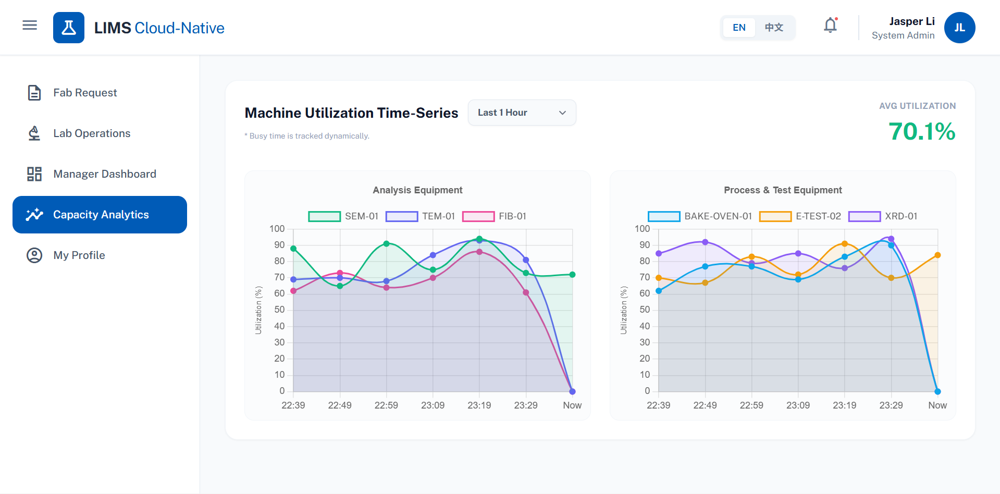

# LIMS Cloud-Native (實驗室資訊管理系統)




LIMS (Laboratory Information Management System) 是一個專為高科技廠區與實驗室設計的雲原生全端應用程式。本系統提供從廠區委託單建立、實驗室晶圓分發（WIP）、機台狀態管理（FSM）到產能分析的完整解決方案，並內建數位簽章機制以確保流程的不可否認性。

## 技術堆疊 (Tech Stack)

### 前端 (Frontend)
* **核心框架:** React 18
* **建置工具:** Vite
* **開發語言:** TypeScript
* **樣式框架:** Tailwind CSS

### 後端 (Backend)
* **核心框架:** Java Spring Boot
* **開發語言:** Java 25 (LTS)
* **資料存取:** Spring Data JPA (Hibernate)
* **安全認證:** Spring Security (JWT / ECDSA 數位簽章)

### 基礎設施與資料庫 (Infrastructure & Database)
* **容器化:** Docker & Docker Compose
* **關聯式資料庫:** PostgreSQL 15
* **資料庫管理:** pgAdmin 4

---

## 專案架構 (Project Structure)

本專案採用 Monorepo 架構，將前端、後端與基礎設施配置集中管理，確保版本同步與部署一致性。
```text
LIMS/
├── frontend/                 # React 前端專案目錄
│   ├── node_modules/         # (啟動後自動產生) 存放所有下載的前端第三方套件
│   ├── public/               # 靜態資源目錄 (例如 favicon 等不會被 Vite 打包壓縮的檔案)
│   ├── src/                  # 前端原始碼核心目錄 (React Components, Views, Hooks)
│   ├── .gitignore            # 設定 Git 版控應忽略的前端檔案 (如 node_modules)
│   ├── eslint.config.js      # ESLint 程式碼風格與語法檢查工具的設定檔
│   ├── index.html            # 前端應用的進入點 (Entry point) 與根 HTML
│   ├── package-lock.json     # 鎖定當前所有依賴套件的精確版本號，確保團隊環境一致
│   ├── package.json          # 記錄前端專案資訊、依賴套件清單與自訂的 npm 執行腳本
│   ├── README.md             # 專屬於前端子專案的說明文件
│   ├── tsconfig.app.json     # 針對 React 應用程式的 TypeScript 編譯設定
│   ├── tsconfig.json         # TypeScript 基礎設定檔 (繼承並整合其他 tsconfig)
│   ├── tsconfig.node.json    # 針對 Node.js 環境 (如 vite.config.ts) 的 TypeScript 設定
│   └── vite.config.ts        # Vite 打包工具的核心設定檔 (例如設定 proxy 或 plugins)
├── backend/                  # Java Spring Boot 後端專案目錄
│   ├── .mvn/                 # 存放 Maven Wrapper 的核心執行資源檔
│   ├── src/                  # 後端原始碼目錄 (包含 main/java 與 main/resources)
│   ├── .gitattributes        # 設定 Git 處理檔案時的行為 (例如強制換行符號格式)
│   ├── .gitignore            # 設定 Git 版控應忽略的後端檔案 (如 target/ 編譯檔)
│   ├── HELP.md               # Spring Boot 自動生成的專案輔助說明文件
│   ├── mvnw                  # macOS/Linux 適用的 Maven Wrapper 執行腳本
│   ├── mvnw.cmd              # Windows 適用的 Maven Wrapper 執行腳本
│   └── pom.xml               # Maven 專案核心檔，管理 Java 依賴套件與建置生命週期
├── database/                 # 資料庫建置與種子資料腳本目錄
│   └── init.sql              # PostgreSQL 初始綱要 (Schema) 建表與基礎預設資料腳本
├── docs/                     # 專案架構與技術文件存放區
│   ├── erd/                  # 實體關聯圖存放區
│   │   ├── lims-erd.md       # 系統實體關聯圖 (Mermaid 語法原始碼)
│   │   └── lims-erd.png      # 系統實體關聯圖 (輸出的靜態圖片檔)
│   └── project-preview.png   # 專案的系統預覽截圖
├── .env                      # (本地專屬) 環境變數檔，存放真實的資料庫密碼等機密 (不會進入版控)
├── .env.sample               # 環境變數範本檔，提供開發者複製並填寫自己的密碼設定
├── .gitignore                # 系統級別的 Git 忽略清單 (已設定排除所有 *.env 機密檔案)
├── docker-compose.yml        # Docker 服務定義檔，用於一鍵啟動 PostgreSQL 與 pgAdmin 容器
└── README.md                 # 您正在閱讀的主專案說明文件
```

---

## 快速啟動指南 (Getting Started)

請依照以下順序啟動本地端開發環境。這份指南將引導您完成環境變數設定、資料庫容器啟動，以及前後端伺服器的運行。

### 前置作業 (Prerequisites)
請確保開發主機已正確安裝並啟動以下軟體：
* [Docker Desktop](https://www.docker.com/) (必須保持運行狀態以啟動資料庫容器)
* [Node.js](https://nodejs.org/) (建議使用 v20 LTS 或以上版本)
* [Java Development Kit (JDK)](https://www.oracle.com/tw/java/technologies/downloads/) (需支援 Java 25 或以上版本)

---

### Step 1: 環境變數與資料庫設定

在啟動應用程式之前，您需要設定環境變數，並透過 Docker 將資料庫運行起來。

#### 1. 配置環境變數
專案根目錄下已提供範本檔 `.env.sample`。基於資安考量，我們不在程式碼中寫死密碼。
請在終端機執行以下指令，或手動複製檔案：
```bash
# 複製 .env.sample 建立本地 .env 配置檔
cp .env.sample .env
```
建立完成後，請打開 `.env` 檔案，根據需求自訂安全的 `DB_PASSWORD` 與 `PGADMIN_PASSWORD`。

#### 2. 啟動資料庫容器
確認 Docker Desktop 已在背景運行。接著使用 Docker Compose 啟動 PostgreSQL 資料庫與 pgAdmin 管理介面。
```bash
# 在背景運行所有定義在 docker-compose.yml 中的容器
docker-compose up -d
```
* **參數：** `-d` 代表以背景模式 (Detached mode) 運行，這樣啟動後就不會卡住您的終端機視窗，可以繼續輸入其他指令。
* **自動初始化：** 當 PostgreSQL 容器初次建立並啟動時，它會自動讀取我們寫好的 `database/init.sql`，完成所有資料表 (Tables) 的建立，並注入預設的六大權限角色與機台狀態等種子資料。

#### 3. 驗證資料庫連線 (選用)
容器啟動後，您可以開啟瀏覽器前往 **[http://localhost:5050](http://localhost:5050)**。
使用 `.env` 中設定的 Email 與 `PGADMIN_PASSWORD` 登入 pgAdmin。新增伺服器連線（Host 填寫 `postgres`, Port 填寫 `5432`），即可視覺化檢視剛剛初始化的 `lims_db` 資料庫結構與資料。

---

### Step 2: 啟動 Spring Boot 後端伺服器

接下來，我們將編譯並啟動 Java 後端伺服器，它將負責處理商業邏輯並連接剛剛建立的資料庫。

#### 啟動開發伺服器
```bash
# 進入後端目錄
cd backend

# 使用 Maven Wrapper 啟動應用程式
# macOS / Linux 使用者:
./mvnw spring-boot:run

# Windows 使用者:
mvnw spring-boot:run
```

* **背景知識：** 什麼是 `mvnw` (Maven Wrapper)？
它是一個腳本，能確保所有團隊成員都使用完全相同版本的 Maven 建置工具。當您執行該腳本時，系統會自動下載專案所需的 Java 依賴套件並進行編譯，您無須在電腦上預先安裝 Maven。
* 待終端機停止滾動，並顯示類似 `Started Application in X.XXX seconds` 的訊息後，即代表後端 API 伺服器已成功運行於 **[http://localhost:8080](http://localhost:8080)**。

---

### Step 3: 啟動 React 前端開發伺服器

請保持後端伺服器運行，**開啟一個新的終端機視窗**來啟動前端介面。

#### 1. 安裝依賴套件
```bash
# 確保位於 LIMS 專案根目錄，然後進入前端目錄
cd frontend

# 安裝 package.json 中列出的所有前端依賴套件
npm install
```
* **背景知識：** `npm` 是 Node Package Manager，它是 Node.js 環境預設的套件管理工具。`npm install` 指令會讀取 `package.json`，並嚴格依照 `package-lock.json` 中紀錄的精確版本號，將所需的第三方工具（如 React, Tailwind 等）下載到 `node_modules` 資料夾中。這確保了每位開發者擁有一致的開發環境，防止套件版本衝突。

#### 2. 啟動 Vite 本地開發伺服器
```bash
# 啟動具備熱更新 (Hot-Reload) 功能的開發伺服器
npm run dev
```
* **背景知識：** `npm run dev` 是一個捷徑指令。它會去尋找 `package.json` 的 `"scripts"` 區塊中定義的 `"dev"` 命令並執行它。
* 伺服器啟動後，終端機會顯示一個本機網址（通常預設為 **[http://localhost:5173](http://localhost:5173)**）。請在瀏覽器中開啟該網址，即可看見並操作 LIMS 系統介面！

---

## 核心功能模組 (Core Modules)

1. **Role-Based Access Control (RBAC):** 嚴謹的角色權限分離，支援六大基礎角色，保護實驗室核心資料與操作端點。
2. **Crypto-Signed Requests:** 委託單的提交與簽核皆透過 ECDSA 數位簽章與 SHA-256 雜湊處理，確保電子紀錄不可竄改。
3. **Finite State Machine (FSM):** 機台具備 `IDLE`, `PROCESSING`, `ALARM`, `MAINTENANCE` 等嚴格的狀態轉換邏輯與防呆機制。
4. **WIP Tracking:** 細顆粒度至單一晶圓 (Wafer ID) 的派發、排程與生命週期追蹤。