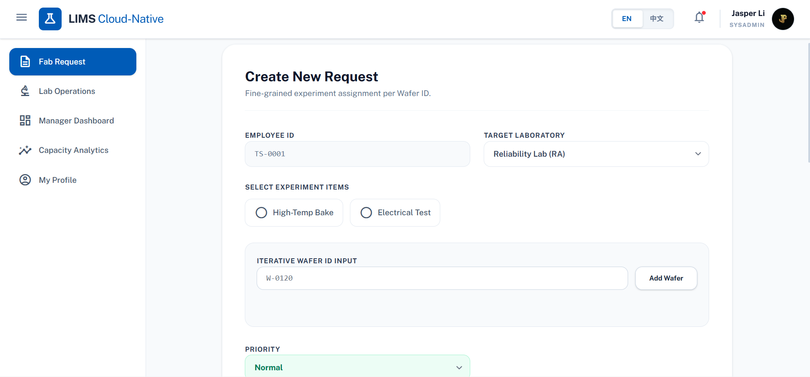

# Cloud-Native LIMS (實驗室資訊管理系統)




LIMS (Laboratory Information Management System) 是一個專為高科技廠區與實驗室設計的雲原生全端應用程式。本系統提供從廠區委託單建立、實驗室晶圓分發（WIP）、機台狀態管理（FSM）到產能分析的完整解決方案。透過導入資訊安全實踐與雲端原生架構，系統內建 ECDSA 數位簽章與 SHA-256 雜湊機制，確保整體操作流程的不可否認性與資料完整性。

## 系統架構與容器網路拓撲 (System Architecture & Network Topology)

本專案採用現代化微服務單體儲存庫 (Monorepo) 架構，透過 **Docker Compose** 實施多容器整合編排。全系統共劃分為 4 個獨立容器節點，共享底層橋接網路 (`bridge_network`)：

1. **`lims_frontend` (Vite + React 18)**: 對外對照本機 `5173` 埠，透過高效率的 Volume 掛載實作源碼雙向綁定，支援熱插拔 (HMR) 偵測。
2. **`lims_backend` (Spring Boot 3.x + Java 25)**: 對外對照本機 `8080` 埠，採用多階段安全建置 (Multi-stage Build)，內部透過服務域名 `postgres:5432` 與資料庫實作內部網路直連，阻絕外網直攻。
3. **`lims_db` (PostgreSQL 15)**: 廠區與實驗室實體資料持久化中心，配置 pgdata 資料卷防丟失機制，並掛載 init.sql 實作開機自動化 DDL 結構初始化與 60 筆 WIP 測試數據注入。為落實嚴謹的存取控制，本節點與初始化腳本中絕對不包含任何預設測試帳號 (No Default Credentials)。
4. **`lims_pgadmin` (pgAdmin 4)**: 圖形化資料庫管理中樞，跑在本機 `5050` 埠，方便開發團隊即時抽查通知審計日誌與機台流轉狀態。

---

## 專案架構 (Project Structure)

本專案採用 Monorepo 架構，將前端、後端與基礎設施配置集中管理，確保版本同步與部署一致性。若需深入了解各模組的開發細節，請參閱子目錄下的專屬說明文件：

* 📘 **[前端詳細文件 (Frontend README)](./frontend/README.md)**
* 📙 **[後端詳細文件 (Backend README)](./backend/README.md)**
* 📊 **[系統實體關聯圖 (Database ERD)](./docs/erd/lims-erd.md)**

```text
LIMS/
├── frontend/                 # React 前端專案目錄
│   ├── node_modules/         # (啟動後自動產生) 存放所有下載的前端第三方套件
│   ├── public/               # 靜態資源目錄
│   └── src/                  # 前端原始碼目錄 (React Components, Views)
│
├── backend/                  # Java Spring Boot 後端專案目錄
│   ├── .mvn/                 # 存放 Maven Wrapper 的核心執行資源檔
│   ├── src/                  # 後端原始碼目錄 (main/java, main/resources)
│   ├── .gitattributes
│   ├── .gitignore
│   ├── mvnw                  # macOS/Linux 適用的 Maven Wrapper 執行腳本
│   ├── mvnw.cmd              # Windows     適用的 Maven Wrapper 執行腳本
│   └── pom.xml               # 管理依賴套件與建置生命週期的 Maven 核心設定檔
│
├── database/
│   └── init.sql              # PostgreSQL 初始 Schema 與預設資料腳本
│
├── docs/
│   ├── erd/
│   │   ├── lims-erd.md       # 系統實體關聯圖 (Mermaid 原始碼)
│   │   └── lims-erd.png      # 系統實體關聯圖 (靜態圖片檔)
│   └── project-preview.png   # 系統預覽截圖
│
├── .env                      # 本地環境變數檔，存放真實密碼與金鑰 (不會進入版控)
├── .env.sample               # 環境變數範本檔，提供開發者複製並填寫自己的密碼設定
├── .gitignore
├── docker-compose.yml        # 用於一鍵啟動 PostgreSQL 與 pgAdmin 容器
└── README.md
```

---
## 快速啟動與雙模式開發指南 (Deployment & Run Guide)

本專案支援兩種模式，請依據團隊協作需求選擇： 
* **Mode A: 全端容器化一鍵啟動（適合一鍵環境對齊與雲端部署預演）** 
* **Mode B: 本地裸機手動啟動（適合深度排錯與熱重載）**

---
### 模式 A：全端容器化一鍵啟動 (Docker Compose Orchestration)

此模式下您不需要在本機電腦安裝 Java、Node.js、Maven、PostgreSQL 等繁雜環境，僅需安裝 Docker Desktop。

### 前置作業 (Prerequisites)
請確保開發主機已正確安裝並啟動 [Docker Desktop](https://www.docker.com/)

### Step 1: 檢查與備妥環境變數
請確保專案根目錄下存在 .env 檔案（可複製 .env.sample），其內部配置將自動被 Docker 讀取並注入各個服務節點中。
```bash
# 複製 .env.sample 建立本地 .env 配置檔
cp .env.sample .env
```
建立完成後，請打開 `.env` 檔案設定以下機密資訊：

1. **資料庫密碼：** 自訂安全的 `DB_PASSWORD` 與 `PGADMIN_PASSWORD`。
2. **系統安全金鑰：** 為了系統安全，`JWT_SECRET` 與 `AES_MASTER_KEY` 必須是 256-bit (32 bytes) 的隨機高強度密碼。請在終端機中執行以下指令兩次，分別生成字串並填入這兩個欄位中：
```bash
openssl rand -base64 32
```

### Step 2: 一鍵啟動全端網路上線
確認 Docker Desktop 已在背景運行。接著請在專案根目錄開啟終端機，執行以下核心編排指令：
```bash
# 建立映像檔並於背景啟動所有前端、後端、資料庫與管理工具
docker compose up -d --build
```
* `-d`：以背景模式 (Detached mode) 運行。這樣啟動後就不會卡住您的終端機視窗，可以繼續輸入其他指令。
* `--build`：告訴 Docker「不要使用舊的快取映像檔」，請重新執行 Dockerfile 裡的每一行指令（這會把最新的 src 複製進去，並執行 mvnw package 編譯出全新的 app.jar）。

### Step 3: 驗證系統存取點

* **前端 Web 介面**: `http://localhost:80`
* **後端 API 網關**: `http://localhost:8080/api/v1`
* **資料庫管理工具 (pgAdmin)**: `http://localhost:5050` (登入帳密請參閱 `.env` 設定)

### Step 4: 常用維護與重啟指令

當您修改了後端 Java 程式碼或前端架構時，可以使用以下防刷安全指令：
```bash
# 情境 A：只重新編譯並部署後端，不影響資料庫與前端
docker compose up -d --build backend

# 情境 B：即時追蹤後端 Spring Boot 的運行或錯誤日誌 (用來捕捉 500 錯誤)
docker compose logs -f backend

# 情境 C：完全關閉系統並清理內部網路
docker compose down
```

---
### 模式 B：本地裸機手動啟動 (Local Bare-Metal Development)

此模式適合需要使用 IDE（如 VS Code）進行斷點除錯（Breakpoint Debugging）的開發場景。

### 前置作業 (Prerequisites)
請確保開發主機已正確安裝並啟動以下軟體：
* [Node.js](https://nodejs.org/) (建議使用 v20 LTS 或以上版本)
* [Java Development Kit (JDK)](https://www.oracle.com/tw/java/technologies/downloads/) (需支援 Java 25 或以上版本)
* [PostgreSQL](https://www.postgresql.org/download/) 

### Step 1: 環境變數與資料庫設定

在啟動應用程式之前，您需要設定環境變數，並透過 Docker 將資料庫運行起來。

#### 1. 配置環境變數
專案根目錄下已提供範本檔 `.env.sample`。基於資安考量，我們不在程式碼中寫死密碼。
請在終端機執行以下指令，或手動複製檔案：
```bash
# 複製 .env.sample 建立本地 .env 配置檔
cp .env.sample .env
```

建立完成後，請打開 `.env` 檔案設定以下機密資訊：

1. **資料庫密碼：** 自訂安全的 `DB_PASSWORD` 與 `PGADMIN_PASSWORD`。
2. **系統安全金鑰：** 為了系統安全，`JWT_SECRET` 與 `AES_MASTER_KEY` 必須是 256-bit (32 bytes) 的隨機高強度密碼。請在終端機中執行以下指令兩次，分別生成字串並填入這兩個欄位中：
```bash
openssl rand -base64 32
```

#### 2. 本地資料庫初始化
請確保本機已安裝並運行 PostgreSQL 15+ 伺服器。建立專屬資料庫後，請手動匯入 `database/init.sql` 腳本進行自動化配置。該腳本具備冪等性 (Idempotency) 設計，能一鍵完成 DDL 結構初始化，並自動注入 RBAC 基礎權限矩陣、機台實體配置，以及供開發驗證用的 WIP 測試資料集。

#### 3. 資料庫連線驗證與 pgAdmin 圖形化操作
請開啟瀏覽器並前往資料庫管理中樞 **[http://localhost:5050](http://localhost:5050)**

**A. 伺服器註冊與連線配置**
1. **登入 pgAdmin：** 使用 `.env` 中設定的 `PGADMIN_EMAIL` 與 `PGADMIN_PASSWORD` 登入。
2. **新增伺服器連線：** 在左側選單右鍵點擊 `Servers` -> `Register` -> `Server...`。
   * **General 頁籤：** Name 隨意填寫（例如：`LIMS-DB`）
   * **Connection 頁籤：** * **Host name/address** 填寫：`postgres` (此為 Docker 內部網路的服務名稱)
     * **Port** 填寫：`5432`
     * **Maintenance database** 填寫：`lims_db` (對應 `.env` 的 `DB_NAME`)
     * **Username** 填寫：`lims_admin` (對應 `.env` 的 `DB_USER`)
     * **Password** 填寫：您設定的 `DB_PASSWORD`

**B. 資料探索與查詢驗證**
1. **結構導覽：** 儲存連線配置後，依序展開樹狀目錄： `Servers` -> `LIMS-DB` -> `Databases` -> `lims_db` -> `Schemas` -> `public` -> `Tables`，即可檢視完整的系統資料表關聯結構。
2. **視覺化檢視：** 若需快速查閱資料，請在在目標資料表（例如：users 或其他表）名稱上按滑鼠右鍵，將滑鼠游標移到 View/Edit Data（查看/編輯資料），在展開的選單中，點選 All Rows，系統將開啟資料網格視窗供您進行直觀的檢視。
3. **自訂 SQL 查詢：** 如果你想做更複雜的篩選（例如只想看某一天的資料），可以自己寫點簡單的指令：
    1. 滑鼠左鍵點一下選中你的資料表。
    2. 在 pgAdmin 最上方的那排工具列，點擊一個像「資料庫加上播放鍵」的圖示，它叫 Query Tool（查詢工具）。
    3. 右側會彈出一個可以打字的空白視窗，即可在裡面輸入指令，並點擊該視窗上方的按鈕執行，下方的 Data Output 就會秀出內容了。

---

### Step 2: 啟動 Java Spring Boot 後端伺服器

接下來，我們將編譯並啟動 Java 後端伺服器，它將負責處理商業邏輯並連接剛剛建立的資料庫。

#### 啟動開發伺服器
```bash
# 進入後端目錄
cd backend

# 使用 Maven Wrapper 啟動應用程式
./mvnw spring-boot:run  # macOS / Linux
.\mvnw spring-boot:run  # Windows
```

* `mvnw` **(Maven Wrapper)** 是一個腳本，能確保所有團隊成員都使用完全相同版本的 Maven 建置工具。當您執行該腳本時，系統會自動下載專案所需的 Java 依賴套件並進行編譯，您無須在電腦上預先安裝 Maven。
* 待終端機停止滾動，並顯示 `Started BackendApplication in X.XXX seconds` ，即代表後端 API 伺服器已成功運行於 **[http://localhost:8080](http://localhost:8080)**

---

### Step 3: 啟動 React 前端開發伺服器

請保持後端伺服器運行，**開啟一個新的終端機視窗**來啟動前端介面。

#### 1. 安裝依賴套件
```bash
# 確保位於 LIMS 專案根目錄，然後進入前端目錄
cd frontend

# 安裝 package.json 中列出的所有前端依賴套件
npm install
```
* **背景知識：** `npm` 是 Node Package Manager，它是 Node.js 環境預設的套件管理工具。`npm install` 指令會讀取 `package.json`，並嚴格依照 `package-lock.json` 中紀錄的精確版本號，將所需的第三方工具（如 React, Tailwind 等）下載到 `node_modules` 資料夾中。這確保了每位開發者擁有一致的開發環境，防止套件版本衝突。

#### 2. 啟動 Vite 本地開發伺服器
```bash
# 啟動具備熱更新 (Hot-Reload) 功能的開發伺服器
npm run dev
```
* `npm run dev` 是一個捷徑指令，它會去尋找 `package.json` 的 `"scripts"` 區塊中定義的 `"dev"` 命令並執行它。
* 伺服器啟動後，終端機會顯示一個本機網址（預設為 **[http://localhost:5173](http://localhost:5173)**）。請在瀏覽器中開啟該網址，即可看見並操作 LIMS 系統介面！

---

## 核心功能模組 (Core Modules)

1. **Role-Based Access Control (RBAC):** 嚴謹的角色權限分離，支援六大基礎角色，保護實驗室核心資料與操作端點。
2. **Crypto-Signed Requests:** 結合資訊鑑識與密碼學原則，委託單的提交與簽核皆透過 ECDSA 數位簽章與 SHA-256 雜湊處理，確保電子紀錄不可竄改且來源可被精準驗證。
3. **Finite State Machine (FSM):** 機台具備 `IDLE`, `PROCESSING`, `ALARM`, `MAINTENANCE` 等嚴格的狀態轉換邏輯與防呆機制。
4. **WIP Tracking:** 細顆粒度至單一晶圓 (Wafer ID) 的派發、排程與生命週期追蹤。