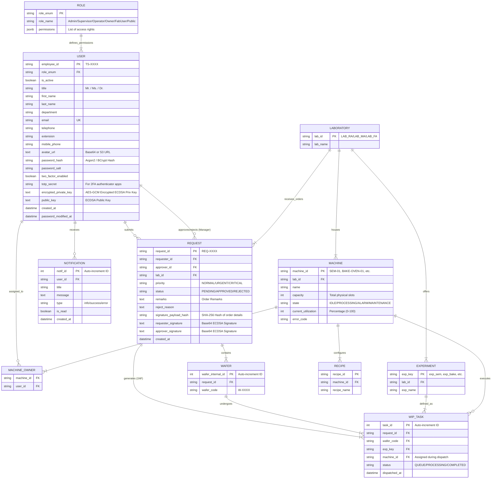

# LIMS Cloud-Native Entity Relationship Diagram

```mermaid
erDiagram
    USER ||--o{ REQUEST : "submits"
    USER ||--o{ REQUEST : "approves/rejects (Manager)"
    USER ||--o{ NOTIFICATION : "receives"
    USER ||--o{ MACHINE_OWNER : "assigned_to"
    
    ROLE ||--|{ USER : "defines_permissions"
    
    LABORATORY ||--|{ REQUEST : "receives_orders"
    LABORATORY ||--|{ EXPERIMENT : "offers"
    LABORATORY ||--|{ MACHINE : "houses"
    
    REQUEST ||--|{ WAFER : "contains"
    REQUEST ||--|{ WIP_TASK : "generates (1NF)"
    
    WAFER ||--|{ WIP_TASK : "undergoes"
    EXPERIMENT ||--|{ WIP_TASK : "defined_as"
    
    MACHINE ||--o{ WIP_TASK : "executes"
    MACHINE ||--|{ RECIPE : "configures"
    MACHINE ||--|{ MACHINE_OWNER : "managed_by"

    %% ------------------------------------------
    %% Entity Definitions
    %% ------------------------------------------

    ROLE {
        string role_enum PK
        string role_name "Admin/Supervisor/Operator/Owner/FabUser/Public"
        jsonb permissions "List of access rights"
    }

    USER {
        string employee_id PK "TS-XXXX"
        string role_enum FK
        boolean is_active
        string title "Mr. / Ms. / Dr."
        string first_name
        string last_name
        string department
        string email UK
        string telephone
        string extension
        string mobile_phone
        text avatar_url "Base64 or S3 URL"
        %% Security & Crypto Fields %%
        string password_hash "Argon2 / BCrypt Hash"
        string password_salt
        boolean two_factor_enabled
        string totp_secret "For 2FA authenticator apps"
        text encrypted_private_key "AES-GCM Encrypted ECDSA Priv Key"
        text public_key "ECDSA Public Key"
        datetime created_at
        datetime password_modified_at
    }

    LABORATORY {
        string lab_id PK "LAB_RA/LAB_MA/LAB_FA"
        string lab_name
    }

    EXPERIMENT {
        string exp_key PK "exp_sem, exp_bake, etc."
        string lab_id FK
        string exp_name
    }

    REQUEST {
        string request_id PK "REQ-XXXX"
        string requester_id FK
        string approver_id FK
        string lab_id FK
        string priority "NORMAL/URGENT/CRITICAL"
        string status "PENDING/APPROVED/REJECTED"
        text remarks "Order Remarks"
        text reject_reason
        %% Non-repudiation / Signature Fields %%
        string signature_payload_hash "SHA-256 Hash of order details"
        text requester_signature "Base64 ECDSA Signature"
        text approver_signature "Base64 ECDSA Signature"
        datetime created_at
    }

    WAFER {
        int wafer_internal_id PK "Auto-increment ID"
        string request_id FK
        string wafer_code "W-XXXX"
        %% Note: (request_id, wafer_code) forms a UNIQUE constraint
    }

    WIP_TASK {
        int task_id PK "Auto-increment ID"
        string request_id FK
        string wafer_code FK
        string exp_key FK
        string machine_id FK "Assigned during dispatch"
        string status "QUEUE/PROCESSING/COMPLETED"
        datetime dispatched_at
    }

    MACHINE {
        string machine_id PK "SEM-01, BAKE-OVEN-01, etc."
        string lab_id FK
        string name
        int capacity "Total physical slots"
        string state "IDLE/PROCESSING/ALARM/MAINTENANCE"
        int current_utilization "Percentage (0-100)"
        string error_code
    }

    RECIPE {
        string recipe_id PK
        string machine_id FK
        string recipe_name
    }

    NOTIFICATION {
        int notif_id PK "Auto-increment ID"
        string user_id FK
        string title
        text message
        string type "info/success/error"
        boolean is_read
        datetime created_at
    }

    MACHINE_OWNER {
        string machine_id FK
        string user_id FK
    }
```